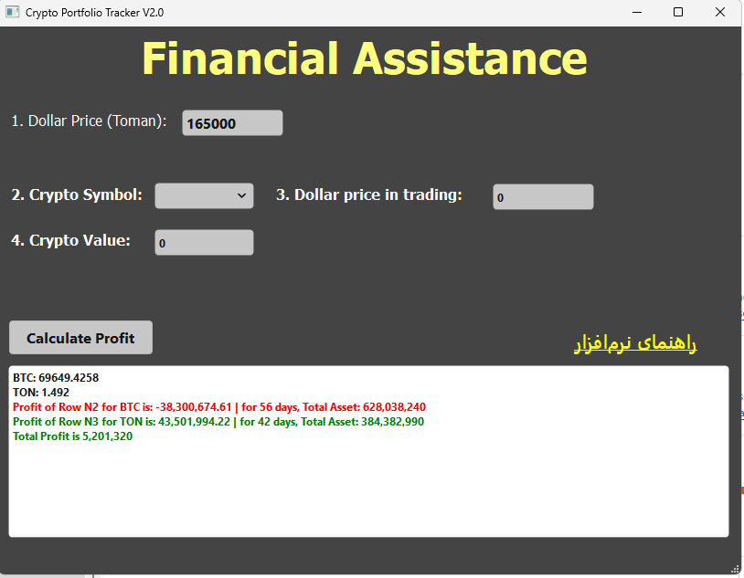

# Crypto Portfolio Tracker V2.0 — راهنمای استفاده


    


## معرفی برنامه

این برنامه برای مدیریت و محاسبه سود و زیان معاملات ارز دیجیتال طراحی شده است.

ایده ساخت این برنامه از یک نیاز واقعی شکل گرفت. من شخصاً از چندین صرافی مختلف اقدام به خرید ارزهای دیجیتال می‌کردم و به دلیل انتقال مداوم دارایی‌ها بین کیف‌پول‌ها و صرافی‌های مختلف، به‌مرور زمان محاسبه دقیق سود و زیان برایم دشوار شد و عملاً حساب‌وکتاب معاملاتم از دستم خارج شد.

به همین دلیل این ابزار را طراحی کردم تا بتوانم پس از هر خرید، اطلاعات معامله را ثبت کرده و در هر زمان سود، زیان و ارزش واقعی دارایی‌های خود را به‌صورت دقیق محاسبه و مشاهده کنم.

این برنامه با استفاده از قیمت لحظه‌ای ارزها از CoinMarketCap و اطلاعات ثبت‌شده شما، سود و ارزش دارایی را محاسبه می‌کند.

---

## 1. دریافت API از CoinMarketCap

برای اجرای صحیح برنامه، **حتماً باید یک API Key معتبر از سایت CoinMarketCap دریافت کنید.**

### مراحل

1. به سایت زیر مراجعه کنید:  
   https://coinmarketcap.com/api/

2. ثبت‌نام / ورود انجام دهید و یک **API Key** بسازید.

3. کلید دریافت‌شده را داخل یک فایل متنی با نام زیر قرار دهید:

```
api.txt
```

### نکات مهم

- داخل فایل فقط **خود API Key** باشد  
- بدون فاصله، بدون خط اضافه، بدون کوتیشن  
- مثال:

```
fa5xxxxxxxxxxxxxxxxxxxxxxxxxxxxsnMf
```

---

## 2. وارد کردن قیمت دلار در هر اجرا

هر بار که برنامه را اجرا می‌کنید، **حتماً باید قیمت روز دلار (USDT)** را در **باکس اول** وارد کنید.

در صورت وارد نکردن این مقدار، محاسبات سود و ارزش دارایی‌ها نادرست خواهد بود.

---

## 3. اگر تریدی ندارید

اگر معامله‌ای انجام نداده‌اید، مقادیر زیر را وارد کنید:

- باکس شماره 3 (مقدار کریپتو) = `0`  
- باکس شماره 4 (قیمت خرید دلاری) = `0`  

در این حالت هیچ رکوردی در دیتابیس ثبت نخواهد شد.

---

## 4. ثبت معاملات

پس از هر خرید، اطلاعات معامله شامل مقدار ارز، قیمت خرید و نماد ارز را وارد کرده و دکمه محاسبه را بزنید. برنامه معامله را ذخیره کرده و سود و ارزش دارایی شما را محاسبه می‌کند.

---

## 5. ویرایش یا اصلاح معاملات

اگر:

- مقداری را اشتباه وارد کرده‌اید  
- قصد تغییر معاملات قبلی را دارید  
- یا می‌خواهید رکوردی را حذف کنید  

باید فایل زیر را به‌صورت دستی ویرایش کنید:

```
prices.csv
```

این فایل دیتابیس محلی معاملات شماست و شامل موارد زیر می‌باشد:

- مقدار خرید  
- قیمت خرید  
- قیمت دلار در زمان خرید  
- نماد ارز  
- تاریخ ثبت  

### نکات مهم

- ساختار فایل را تغییر ندهید  
- ردیف اول (Header) را حذف نکنید  
- ترتیب ستون‌ها را جابجا نکنید  

---

## نحوه محاسبه

برنامه با استفاده از:

- قیمت لحظه‌ای ارز از CoinMarketCap  
- قیمت دلار واردشده توسط شما  
- اطلاعات معاملات ثبت‌شده  

موارد زیر را محاسبه می‌کند:

- سود یا زیان هر معامله  
- ارزش فعلی دارایی  
- مدت زمان نگهداری دارایی  

---

## نکات پایانی

- API معتبر + قیمت دلار صحیح = محاسبه دقیق سود  
- `prices.csv` = تاریخچه کامل معاملات شما  
- `api.txt` = کلید اتصال به CoinMarketCap  
- بدون اینترنت، دریافت قیمت لحظه‌ای امکان‌پذیر نیست  

---

## هدف برنامه

این ابزار برای افرادی طراحی شده که:

- از چند صرافی مختلف خرید می‌کنند  
- دارایی خود را بین کیف‌پول‌ها جابه‌جا می‌کنند  
- می‌خواهند سود و زیان واقعی خود را بدانند  
- به یک ابزار ساده، سبک و آفلاین برای ثبت معاملات نیاز دارند  

---

© Crypto Portfolio Tracker
